# Versioned Datasets
## Rethinking Local In-Memory Caches

ACM Fremont Chapter - Emerging Technologies Tech Talk

**Viswanathan Ranganathan** (Vish)

November 16, 2025

<!--
SPEAKER NOTES - Opening Story (The Cache Stampede):

"Let me start with a story that might sound familiar.

It's 2 PM on a Monday. Everything's running smoothly. Your cache just expired—it's been serving data for the past hour, and now it's time to refresh.

But here's what happens: All 50 of your service instances realize the cache is empty at the exact same moment. They all race to reload it.

50 simultaneous queries hit your database asking for the same 2 GB of data. Your database grinds to a halt. Response times go from milliseconds to minutes. Users start seeing errors.

By the time you realize what's happening, you're in the middle of a full outage.

Sound familiar?"

[PAUSE - Let it sink in]
-->

---
layout: center
---

> "There are only two hard things in Computer Science:
> cache invalidation,
> naming things,
> and off-by-one errors."
>
> — Phil Karlton

<style>
blockquote {
  font-size: 1.2rem !important;
  line-height: 1.6 !important;
  padding: 2rem !important;
}
</style>

<!--
"And you know what? Phil Karlton was absolutely right about this quote. Caching is one of those fundamental problems we deal with constantly, yet it remains surprisingly complex.

Today, we're going to tackle one of those hard problems—and I want to show you a different way of thinking about it."
-->

---
layout: center
class: text-center
---

# The Need for Speed

Modern applications need to serve data **fast**.

<v-click>

When handling thousands of requests per second, **every millisecond matters**.

</v-click>

<v-click>

**One Solution:** Caching

But where should the cache live?

</v-click>

<!--
"Let's set the context. In modern distributed systems, data is typically served through APIs. You might have product catalogs, user profiles, configuration data—and multiple services all depend on that same dataset.

The need is simple: microsecond latency for high-frequency access. When you're handling millions of requests per second, every millisecond matters.

That's where in-memory caching becomes essential. But the question is: where should that cache live?"
-->

---
layout: center
---

# Two Options for Caching

```mermaid {scale: 0.6}
graph LR
    subgraph Apps["  "]
        subgraph App1["Application Instance 1"]
            Local1[Local Cache<br/>~few μs latency]
        end

        subgraph App2["Application Instance 2"]
            Local2[Local Cache<br/>~few μs latency]
        end

        subgraph App3["Application Instance 3"]
            Local3[Local Cache<br/>~few μs latency]
        end
    end

    subgraph ExtCache["Distributed Cache<br/>(Redis/Memcached)"]
        Cache[Shared Cache<br/>1-5ms latency]
    end

    App1 -.->|Network| Cache
    App2 -.->|Network| Cache
    App3 -.->|Network| Cache

    style Local1 fill:#ccffcc
    style Local2 fill:#ccffcc
    style Local3 fill:#ccffcc
    style Cache fill:#ffcccc
    style App1 fill:#e8f5e9,stroke:#2e7d32,stroke-width:2px
    style App2 fill:#e8f5e9,stroke:#2e7d32,stroke-width:2px
    style App3 fill:#e8f5e9,stroke:#2e7d32,stroke-width:2px
    style ExtCache fill:#ffebee,stroke:#c62828,stroke-width:2px
    style Apps fill:none,stroke:none
```



<!--
[Point to diagram]

"You have two fundamental options: local caches in each instance—microsecond latency, no network calls. Or distributed caches like Redis—shared state but every access requires a network call, adding 1 to 5 milliseconds.

For certain dataset characteristics, local caching makes a lot of sense. Let me show you when."
-->

---

<div class="text-center">

# The "Redis is Overkill" Scenario

Not every caching problem needs a distributed solution.

</div>

<v-click>

## Dataset Characteristics
- **Size:** 100 MB to 5 GB
- **Access pattern:** Heavily read-dominated (100:1 or higher)
- **Update frequency:** Every few minutes to hours

</v-click>

<v-click>

## Why Not Redis/Memcached?
- **Network latency:** 1-5ms vs <1μs for local memory (**1000x difference**)
- **Infrastructure complexity:** Clusters, failover, monitoring, replication
- **Operational overhead:** Another system to manage, patch, scale

</v-click>

<!--
"But here's the thing—not every caching problem needs a distributed solution.

Let me paint a specific scenario. Your dataset characteristics look like this:

[Click] Size: somewhere between 100 megabytes and 5 gigabytes. Access pattern: heavily read-dominated—think 100 reads for every 1 write. Update frequency: you're refreshing every few minutes to hours.

[Click] Now, you could reach for Redis. But consider the trade-offs:
- Network latency—even on a fast network, 1 to 5 milliseconds per call versus local memory at under a microsecond. That's a thousand times difference.
- Infrastructure complexity—clusters, failover, monitoring, replication
- Operational overhead—it's another system to manage

For this scale, the risk often outweighs the reward. So the decision makes sense: use a local in-memory cache."
-->

---

<div class="text-center">

# Local In-Memory Cache

</div>

Great libraries available:
- **Caffeine**
- **Guava Cache**
- **Ehcache**

<v-click>

These solve cache invalidation well:
- TTL, size-based eviction
- Thread-safe, concurrent access
- Production-proven

</v-click>

<v-click>

## But...

Operational challenges persist, especially with multi-gigabyte datasets.

</v-click>

<!--
"There are excellent libraries available: Caffeine, Guava Cache, Ehcache—all production-proven. They handle TTL, eviction policies, thread-safety—all the cache invalidation patterns work well.

But operational challenges persist, especially when your dataset is multiple gigabytes."
-->

---

# Challenge: Cold Starts + Memory Spikes

<v-click>

**Scenario:** Service restart, deployment, scale-up

Cache starts **completely empty**

</v-click>

<v-click>

<div class="grid grid-cols-2 gap-4 mt-4">

<div>

## Option A: Load on-demand
- Cache misses → DB stampede
- Response times: **seconds**
- Source system overloaded

</div>

<div>

## Option B: Pre-warm cache
- Query all data from DB
- **2 GB = 3-5 minutes** to load
- Service unavailable during warmup

</div>

</div>

</v-click>

<!--
"Let me show you the core problem. It has two painful symptoms.

[Click] Think about this scenario: you deploy a new version of your service, or an instance restarts, or you're auto-scaling up during a traffic spike. Your cache starts completely empty.

[Click] Now you have two options, neither of them great:

Option A: Load on-demand. The first requests cause cache misses, stampeding your source system. Response times spike from milliseconds to seconds.

Option B: Pre-warm the cache. Query all the data from your source before serving traffic. If you've got a 2 gigabyte catalog, you're looking at 3 to 5 minutes to load everything. During that time? Your service is effectively unavailable.

And this isn't a one-time problem. Every deployment, every scale-up event, every incident recovery—you're waiting minutes for caches to warm up."
-->

---

# Challenge: Full Reloads

<v-click>

**Scheduled job refreshes cache every 10 minutes:**

</v-click>

<v-click>

## Memory Timeline
- **T=0:** Old cache at 2 GB
- **T=30s:** Building new cache = **4 GB total (2x spike!)**
- **T=90s:** Swap reference, old cache becomes garbage
- **T=120s:** After full GC, back to 2 GB

</v-click>

<v-click>

<div style="font-size: 0.9rem; margin-top: 2rem;">

## The GC Problem
- Millions of objects created → promoted to old generation
- Old gen fills → Full GC triggers
- **200-500ms pauses every reload cycle**

</div>

</v-click>

<!--
"But there's more. Your regular updates—let's say every 10 minutes—have their own problem.

[Click] The common pattern: build a completely new cache instance, then atomically swap it with the old one.

[Click] Look at the memory timeline:
- T=0: Old cache sitting at 2 gigabytes
- T=30s: Building new cache while old one serves traffic = 4 gigabytes total—a 2x memory spike
- T=90s: Swap the reference, old cache becomes garbage
- T=120s: After full GC, back down to 2 gigabytes

This 2x memory spike happens every 10 minutes like clockwork.

[Click] And that triggers something worse: when you create millions of objects, they get promoted to old generation. Old gen fills up. Full GC triggers. We're talking 200 to 500 millisecond pauses. Every reload cycle.

The impact? Service latency spikes. Request timeouts. User-facing degradation.

The problem isn't the cache library—it's the reload pattern itself."
-->

---

# The Breaking Point

<v-click>

**The Irony:** These challenges matter most exactly where local caching matters most.

</v-click>

<v-click>

When you have:
- Gigabyte-scale datasets
- Millions of accesses per second

</v-click>

<v-click>

That's when:
- Cold starts are most painful
- Memory spikes are most dangerous
- GC pauses are most impactful

</v-click>

<!--
[Click] "Here's the irony: these challenges matter most exactly where local caching matters most.

[Click] When you have gigabyte-scale datasets with millions of accesses per second—

[Click] That's when cold starts are most painful, memory spikes are most dangerous, and GC pauses are most impactful.

[Pause] So what if we approached this from a completely different angle? What if we stopped thinking about caching and started thinking about data distribution?"
-->

---
layout: center
class: text-center
---

# The Paradigm Shift
## Rethinking the Problem

<!--
[Transition] "So what if we approached this from a completely different angle? What if we stopped thinking about caching and started thinking about data distribution?"
-->

---

# What If We Reframed This?

<v-click>

<div style="font-size: 0.9rem;">

**What's great about distributed caches?**
- One system updates data
- All instances see the change
- Single source of truth
- No coordination needed

</div>

</v-click>

<v-click>

<div style="font-size: 0.9rem;">

**What we don't want:**
- Cluster management
- Network latency
- Infrastructure complexity

</div>

</v-click>

<v-click>

<div style="margin-top: 1rem;">

**What if...**

One process prepares data, publishes it, and all instances consume it locally?

**No network calls for reads, but everyone stays synchronized.**

**"Centralized preparation, decentralized serving"**

</div>

</v-click>

<v-click>

<div style="margin-top: 1rem; font-size: 0.9rem; color: #666;">

(This isn't a silver bullet—but for specific characteristics, it's transformative.)

</div>

</v-click>

<!--
"Let's think about this differently.

[Click] You know what's great about distributed caches like Redis? One system updates the data, and all your application instances see the change. Single source of truth. No coordination needed.

[Click] But we don't want the operational overhead—cluster management, network latency, infrastructure complexity.

[Click] So here's the question: What if one process prepared the data, published it, and all your application instances consumed it locally? No network calls for reads, but everyone stays synchronized.

This is what I call centralized preparation, decentralized serving.

[Click] Now, this isn't a silver bullet for all caching problems. But for a specific set of characteristics, it's transformative."
-->

---

# The Git Analogy

Git has:
- **Commits:** Complete snapshots (immutable)
- **Diffs:** Just the changes
- Only transfers differences

<v-click>

## Apply This to Datasets

</v-click>

<div class="grid grid-cols-2 gap-8 mt-4">

<div v-click>

**Version 1:** Complete dataset
- 10 million products
- 2 GB

</div>

<div v-click>

**Version 2:** Delta from V1
- 5K added, 3K removed, 10K modified
- 9,982,000 products **unchanged**
- Delta is **125 MB, not 2 GB**

</div>

</div>

<!--
"This model mirrors Git perfectly. Git has commits—complete snapshots—and diffs—just the changes. Commits are immutable. Git only transfers differences.

[Click] Apply this to datasets:

[Click] Version 1: Complete dataset—10 million products, 2 gigabytes.

[Click] Version 2: Delta from V1—5K added, 3K removed, 10K modified. The key: 9,982,000 products unchanged. Your delta is 125 megabytes, not 2 gigabytes."
-->

---

# Why This Solves Our Problems

<div style="color: #000000;">

<v-click>

✅ **Cold starts?** Load pre-built snapshots - faster than database queries

</v-click>

<v-click>

✅ **Updates?** Apply small deltas - only what changed

</v-click>

<v-click>

✅ **Memory spikes?** In-place updates - no 2x memory footprint

</v-click>

<v-click>

✅ **GC pressure?** Memory pooling - no mass object creation

</v-click>

</div>

<v-click>

**Result:** Local access performance + centralized data preparation simplicity

</v-click>

<!--
[Click] "Cold starts? Load pre-built snapshots—much faster than database queries.

[Click] Updates? Apply small deltas—only what changed.

[Click] Memory spikes? In-place updates—no 2x memory footprint.

[Click] GC pressure? Memory pooling—no mass object creation.

[Click] You get local access performance with centralized data preparation simplicity.

This is exactly what Hollow does. Let me show you..."
-->

---
layout: center
class: text-center
---

# Introducing Hollow

<!--
[Transition from previous slide]

"This is exactly what Hollow does. Let me show you..."
-->

---

# What is Hollow?

Versioned dataset distribution pattern implemented as an open-source library.

<v-click>

- Came from **Netflix** in 2016
- **Apache 2.0** licensed
- Production-proven at scale
- Not a cache library - a **dataset distribution system**

</v-click>

<!--
"This pattern—versioned dataset distribution—is implemented in an open-source library called Hollow.

[Click] Hollow came out of Netflix in 2016. It's Apache 2.0 licensed, production-proven at scale, and specifically built for this use case.

It's not a cache library—it's a dataset distribution system."
-->

---
layout: center
---

<div class="text-center">

# Architecture Overview

## The Decoupling

</div>


<div class="text-center mt-4" style="font-weight: bold; font-size: 1.1rem;">

**DECOUPLED** - Producer never talks to consumer directly

**FLEXIBLE** - Blob store can be S3, NFS, filesystem, HTTP

</div>

<!--
[Point to diagram]

"It's a producer-consumer model. At the top, your data source—database, API, files, whatever.

The producer is a batch job that runs periodically—say, every 10 minutes. It queries your source, and here's the magic: it automatically calculates diffs from the previous version. You don't write diff logic. You just give it all the data, and Hollow figures out what changed.

It publishes snapshots for new consumers and deltas for existing ones to a blob store—S3, filesystem, NFS, HTTP endpoint—whatever you want.

Your applications are the consumers. They load data into local memory, watch for new versions, and automatically apply deltas when available.

[Point to DECOUPLED] Notice how the producer and consumer never talk to each other directly. They're completely decoupled.

[Point to FLEXIBLE] The blob store can be anything—S3 in production, shared NFS mount, even an HTTP endpoint. This flexibility is key to the pattern's power.

Result: microsecond access with zero network calls. Multiple instances stay synchronized. Data loading completely decoupled from data serving."
-->

---
layout: center
class: text-center
---

# Hollow in Action
## Demo Time

---

# The Demo Setup

Movie catalog with thousands of movies

<v-click>

Producer runs every 2 minutes simulating changes:
- Movies added
- Movies removed
- Ratings updated

</v-click>

<v-click>

**Key Point:** Producer and consumer are completely separate processes.

They communicate through published blobs only.

</v-click>

<!--
"Now let me show you this in action with a working demo. I've got a movie catalog with thousands of movies.

[Click] The producer runs every 2 minutes, simulating real-world changes—a few movies added, some removed, ratings updated.

[Click] The key thing to watch: producer and consumer are separate processes communicating only through published blobs."
-->

---

# Data Model Definition

Simple classes define your data model:

```kotlin
@HollowPrimaryKey(fields = ["id"])
data class Movie(
    val id: Long,
    val title: String,
    val genre: String,
    val rating: Double,
    val releaseYear: Int,
    val duration: Int
)
```

<v-click>

`@HollowPrimaryKey` tells Hollow the unique identifier.

Hollow generates:
- Optimized storage format
- **Type-safe APIs** (compile-time safety, IDE autocomplete, zero reflection)

</v-click>

<!--
"First, you define your data model with simple classes.

[Click] That @HollowPrimaryKey annotation tells Hollow this is our unique identifier. From this simple class, Hollow generates an optimized storage format and type-safe APIs. You get compile-time safety, IDE autocomplete, and zero reflection overhead."
-->

---

# Producer: Publishing Versions

Batch job that creates snapshots:

```kotlin
@Scheduled(fixedDelay = 120000) // Every 2 minutes
fun publishData() {
    producer.runCycle { writeState ->
        currentMovies.forEach { movie ->
            writeState.add(movie)  // Add ALL movies
        }
    }
}
```

<v-click>

**Important:** You give Hollow **all** the data, not just changes.

Hollow automatically compares and creates the delta.

</v-click>

<!--
"Here's the producer code—this is the batch job that creates snapshots.

[Click] Notice something important: you give Hollow all the data, not just what changed. You don't write any diff logic. Hollow automatically compares to the previous version and creates the delta for you."
-->

---

# Producer Terminal Output

**Initialization:**
```log
[INFO] MovieProducer initialized. Data will be published to: ./hollow-data
[INFO] ========================================
[INFO] Starting producer cycle #1 at 2025-11-15T07:09:35
[INFO] Generating initial dataset...
[INFO] Dataset prepared: 50,000 movies
[INFO] Producer cycle #1 completed in 145ms
[INFO] Published 50,000 movies to Hollow
```

---

# Producer Cycle #2

```log
[INFO] ========================================
[INFO] Starting producer cycle #2 at 2025-11-15T07:10:46
[INFO] Generating updated dataset...
[INFO] Dataset prepared: 51,200 movies
[INFO] Producer cycle #2 completed in 152ms
[INFO] Published 51,200 movies to Hollow
[INFO] Snapshot and delta available at: ./hollow-data
[INFO] ========================================
```

<v-click>

**152 milliseconds** to process 51,000+ movies and calculate diffs!

</v-click>

<!--
"Here's what the producer output looks like:

[Show cycle #2 output]

152 milliseconds to process over 51,000 movies and calculate what changed. Fast."
-->

---

# What Gets Published

```bash
$ ls -lh /Users/vranganathan/vish/hollowdemo/hollow-data/

# Snapshots (complete dataset)
snapshot-20251115070935001    10M    # First snapshot (50K movies)
snapshot-20251115071046002    11M    # Second snapshot (51K movies)
snapshot-20251115071050003    11M    # Third snapshot
snapshot-20251115071054004    12M    # Fourth snapshot

# Deltas (only what changed)
delta-20251115070935001-20251115071046002     623K   # V1 -> V2
delta-20251115071046002-20251115071050003     645K   # V2 -> V3
delta-20251115071050003-20251115071054004     666K   # V3 -> V4
delta-20251115071054004-20251115071636005     690K   # V4 -> V5

# Reverse deltas (for rollback)
reversedelta-20251115071046002-20251115070935001     248K
```

<!--
"Now let me show you what's actually written to disk. This is the key moment.

[Show listing]

Look at these numbers: 10 megabytes for a complete snapshot. 623 kilobytes for the delta.

[PAUSE - Let that sink in]

The delta is 16 times smaller because it only contains what changed—maybe 1,200 movies added, some ratings updated. The other 48,800 movies? Not included at all."
-->

---
layout: center
---

<div class="text-center" style="padding: 3rem;">

# The Key Numbers

<div style="font-size: 3rem; font-weight: bold; margin: 2rem 0; color: #2e7d32;">
10 MB
</div>

<div style="font-size: 1.5rem; margin-bottom: 2rem;">
Complete snapshot (50,000 movies)
</div>

<div style="font-size: 1.2rem; margin: 1rem 0;">vs</div>

<div style="font-size: 3rem; font-weight: bold; margin: 2rem 0; color: #1976d2;">
623 KB
</div>

<div style="font-size: 1.5rem; margin-bottom: 2rem;">
Delta (only what changed)
</div>

<div style="font-size: 2rem; font-weight: bold; color: #d32f2f;">
16x smaller!
</div>

</div>

<!--
[Let the slide speak - pause and let the numbers sink in]

"10 megabytes versus 623 kilobytes. 16 times smaller.

[Continue only after pause]

Now imagine this at production scale. 2 gigabyte catalog with similar change rate? Your delta would be around 125 megabytes instead of reloading 2 gigabytes. Still 16 times smaller transfer.

And it compounds—if you have 10 instances pulling updates, that's 90% less network traffic, 90% less load on your blob store."
-->

---

# How Hollow Optimizes Performance

<v-click>

Hollow optimizes across 5 key dimensions:

</v-click>

<v-click>

✅ **Heap footprint** - Fixed-length bit-packed encoding

✅ **Access speed** - Ordinal-based fast lookups

✅ **GC impact** - Memory pooling avoids object tenuring

✅ **Update efficiency** - Incremental deltas only

✅ **Network cost** - 16x-500x smaller transfers

</v-click>

<v-click>

**Result:** Datasets that would be 100+ GB in JSON/XML can be served efficiently in memory.

</v-click>

<!--
"Let me quickly highlight how Hollow achieves these performance gains.

[Click] Hollow optimizes across 5 key dimensions:

[Click]
- Heap footprint: Uses fixed-length bit-packed encoding—much more compact than typical Java objects
- Access speed: Ordinal-based indexing for fast lookups—microsecond latency
- GC impact: Memory pooling and reuse avoids object tenuring—no promotion to old gen
- Update efficiency: Incremental deltas only—not full reloads
- Network cost: 16 to 500 times smaller transfers

[Click] The result? Datasets that would be 100+ gigabytes in JSON or XML can be served efficiently in memory.

This isn't just gzipped JSON—it's a specialized format purpose-built for this exact use case."
-->

---

# Consumer: Loading and Querying

```kotlin
// Initialize consumer - watches for updates
consumer = HollowConsumer
    .withBlobRetriever(blobRetriever)
    .withAnnouncementWatcher(announcementWatcher)
    .withGeneratedAPIClass(MovieAPI::class.java)
    .build()

// Initial load
consumer.triggerRefresh()

// Create index for fast lookups
movieIndex = Movie.uniqueIndex(consumer, "id")
```

<v-click>

Consumer loads initial snapshot, watches for new versions, automatically applies deltas.

</v-click>

<!--
"On the consumer side:

The consumer loads the initial snapshot—just downloads that 10 MB file and unpacks it into memory. Then it watches for new versions. When the producer publishes, the consumer automatically detects it and applies the delta. All automatic."
-->

---

# Consumer Terminal Output

**Initialization:**
```log
[INFO] ========================================
[INFO] Initializing MovieConsumer...
[INFO] Watching for data at: ./hollow-data
[INFO] 🔄 Update started: v-9223372036854775808 -> v20251115070935001
[INFO] ✅ Update successful: v-9223372036854775808 -> v20251115070935001
[INFO]    Update #1 completed
[INFO] Primary key index created for ID lookups (O(1))
[INFO] Genre hash index created for efficient genre queries
[INFO] ========================================
```

<!--
[Show consumer initialization output]

"Consumer initializes, loads the initial snapshot, creates indexes. Ready to serve queries."
-->

---

# Consumer Auto-Update

**When Producer publishes cycle #2:**
```log
[INFO] 🔄 Update started: v20251115070935001 -> v20251115071046002
[INFO] Downloading delta (623 KB)...
[INFO] DELTA APPLIED IN 4ms
[INFO] ========================================
[INFO] ✅ Update successful: v20251115070935001 -> v20251115071046002
[INFO]    Update #2 completed
[INFO]    Last updated: 2025-11-15T07:10:46.892
[INFO] ========================================
```

<v-click>

**4 milliseconds** to apply delta

**Zero downtime** - Queries kept working

**No memory spike, no GC pause**

</v-click>

<!--
"When the producer publishes cycle 2:

[Show auto-update output]

[Click for emphasis] 4 milliseconds. Downloaded 623 KB, applied the delta in-place in 4 milliseconds.

During those 4 milliseconds, queries were still working against the previous version. Then—atomic pointer swap—now serving the new version.

No memory spike, no GC pause, zero downtime.

[Contrast] Compare that to traditional approach: 90 seconds to reload, 4 GB memory spike, 500ms GC pause. This: 4 milliseconds, flat memory."
-->

---
layout: center
class: text-center
---

# Let's Recap What We Just Saw

<v-click>

✅ **Producer & consumer completely decoupled** via blob store

</v-click>

<v-click>

✅ **Blob store is flexible** - S3, NFS, filesystem, HTTP

</v-click>

<v-click>

✅ **10 MB snapshot, 623 KB delta** - 16x compression

</v-click>

<v-click>

✅ **Zero-downtime updates** in 4 milliseconds

</v-click>

<v-click>

Now let's see how you actually **query** this data...

</v-click>

<!--
[Energy shift - lighter, more conversational]

"Alright, let's take a quick breath and recap what we just saw in that demo.

[Click] Producer and consumer are completely decoupled—they never talk to each other, only through the blob store.

[Click] That blob store can be anything—S3 in production, shared filesystem for dev, HTTP endpoint, whatever works for you. Flexible.

[Click] We saw real numbers: 10 megabyte snapshot, 623 kilobyte delta. 16 times compression.

[Click] Updates happened in 4 milliseconds with zero downtime. No memory spike, no GC pause.

[Click] Pretty cool, right? Now let's see how you actually query this data and what makes the APIs special..."
-->

---

# Individual Movie Lookup

**O(1) primary key access:**

```bash
$ curl http://localhost:8081/movies/12345
```

<v-click>

```json
{
  "id": 12345,
  "title": "Inception",
  "genre": "Sci-Fi",
  "rating": 8.8,
  "releaseYear": 2010,
  "duration": 148
}
```

</v-click>

<v-click>

Direct memory access with primary key index - **microsecond latency**

</v-click>

<!--
"Let me query a specific movie:

[Click - show JSON response]

Direct memory access with the primary key index. Version number 20251115071046002—that's our Git-style version identifier. Every consumer knows exactly what version they're serving.

[Click] And the queries are fast—we're talking microseconds because it's all in local memory with O(1) primary key indexes. No network calls, no serialization overhead."
-->

---

# Type-Safe Generated API

```java
// Hollow generates type-safe APIs from your POJOs
MovieAPI api = (MovieAPI) consumer.getAPI();

// Option 1: Iterate all
for (HollowMovie movie : api.getAllHollowMovie()) {
    String title = movie.getTitle().getValue();
    double rating = movie.getRating().getValue();
}

// Option 2: Index-based lookup (preferred)
Movie movie = movieIndex.findMatch(12345L);
```

<v-click>

**Benefits:**
✅ Compile-time type safety
✅ IDE autocomplete
✅ No reflection overhead
✅ Optimized memory layout

</v-click>

<!--
"Now let me show you one of my absolute favorite features of Hollow—the type-safe generated APIs.

This isn't magic reflection or runtime proxies. Here's what happens:

At the producer side, when you define your data model with those simple POJOs, Hollow's code generator creates actual Java classes—MovieAPI, HollowMovie, all the accessor methods. These are real classes, generated at build time.

You then package this generated API as a library and share it with your consumers. Both producer and consumer use the exact same generated classes.

[Click] This gives you incredible benefits:

Compile-time type safety—your IDE and compiler know about these types. If you try to access a field that doesn't exist, you get a compilation error, not a runtime exception.

IDE autocomplete—you get full IntelliSense, code completion, everything.

Zero reflection overhead—these are concrete classes with concrete methods. No reflection, no proxies at runtime.

Optimized memory layout—the generated code is optimized for the bit-packed format we talked about.

This is production-grade type safety. Your consumers can't accidentally query fields that don't exist. Schema changes are caught at compile time. It's one of those features that seems simple but makes a huge difference in operational safety."
-->

---

# Performance Comparison

<div style="font-size: 0.85rem;">

| Metric | Traditional | Hollow | Improvement |
|--------|-------------|---------|-------------|
| Cold Start Time | 3-5 minutes | 10-15 seconds | **20x faster** |
| Memory Peak | 4 GB (2x spike!) | 2.01 GB (flat) | **No spike!** |
| GC Pause (P99) | 200-500 ms | <5 ms | **50x better** |
| Update Downtime | Varies | 0 seconds | **Zero!** |
| DB Load (10 nodes) | 10x per cycle | 1x per cycle | **90% reduction** |

</div>

<v-click>

<div class="text-center mt-4" style="font-weight: bold; font-size: 1.2rem; color: #2e7d32;">

Dramatic improvements across ALL operational metrics

</div>

</v-click>

<!--
[Show comparison table]

"Let me summarize what we just saw side-by-side:

Cold starts: 3-5 minutes down to 10-15 seconds. 20 times faster.

Memory peak: 4 GB spike down to flat 2 GB. No spike at all—you saw that in the demo, just 4 milliseconds to apply the delta.

GC pauses: 200-500 milliseconds down to under 5 milliseconds. 50 times better.

Update downtime: Traditional approach has downtime during reload. Hollow: zero seconds. Atomic swap, queries never interrupted.

Database load with 10 instances: 90% reduction because only the producer queries the source.

[Click] Dramatic improvements across ALL operational metrics. This is the operational win."
-->

---

# Schema Evolution

Data models change. How to handle it?

<div class="grid grid-cols-3 gap-6 mt-8">

<div>

## Adding Fields
✅ Backward compatible
- Producer publishes new fields immediately
- Old consumers ignore them

</div>

<div>

## Removing Fields
⚠️ Requires coordination:
1. Deploy all consumers with updated schema (field removed)
2. Update producer to stop publishing field
3. **Never remove from producer first!**

</div>

<div>

## Type Changes
❌ Breaking change
- Consider new field instead (e.g., `priceV2`)
- Migrate consumers, then remove old field

</div>

</div>

<v-click>

<div class="text-center mt-6" style="font-weight: bold; color: #d32f2f;">

Schema evolution is your biggest operational risk. Plan carefully!

</div>

</v-click>

<!--
"Data models change over time. How do you handle it with Hollow?

Adding fields is backward compatible. Producer can start publishing new fields immediately. Old consumers just ignore them. Deploy new consumers when ready.

Removing fields requires coordination. Deploy all consumers with the field removed FIRST, then update producer to stop publishing it. Never remove from producer first or you'll break old consumers.

Type changes are breaking. Best approach: treat it as a new field—like priceV2. Migrate all consumers to use the new field, then eventually remove the old one.

[Click] Schema evolution is your biggest operational risk. This is where production incidents happen if you're not careful. Plan changes carefully, deploy in the right order, and test thoroughly."
-->

---

# When NOT to Use Hollow

## ❌ Avoid when you have:

<v-click>

- **Under 50 MB** - Traditional cache libraries work great, overhead not justified

</v-click>

<v-click>

- **Over 100 GB** - Too large for single-node memory

</v-click>

<v-click>

- **Real-time consistency needed** - Hollow is eventually consistent (minute-level)

</v-click>

<v-click>

- **Write-heavy workloads** - Hollow is optimized for reads

</v-click>

<v-click>

- **Single instance** - Benefits less compelling with just one instance

</v-click>

<v-click>

<div class="text-center mt-8" style="font-weight: bold; font-size: 1.3rem; color: #d32f2f;">

This is NOT a silver bullet.

</div>

</v-click>

<!--
"Let me be very clear about when NOT to use this pattern. This is important—Hollow is not a silver bullet.

[Click] If your dataset is under 50 megabytes, traditional cache libraries like Caffeine work great. The overhead of this pattern isn't justified.

[Click] If your dataset is over 100 gigabytes, it's too large for single-node memory. You'll need distributed caching or partitioning strategies.

[Click] If you need real-time consistency—updates within seconds—Hollow won't work for you. It's eventually consistent with minute-level cadence. Not suitable for transactional data.

[Click] If you have write-heavy workloads, Hollow is the wrong choice. It's optimized for read-heavy patterns with infrequent batch updates.

[Click] If you only have a single application instance, the benefits are less compelling. Hollow really shines with multiple instances where cold starts and synchronized updates matter.

[Click] This is NOT a silver bullet. It's transformative for specific characteristics: gigabyte-scale, read-heavy, minute-level update cadence, multiple instances. Use the right tool for your specific problem."
-->

---

# Quick Decision Aid

Ask yourself:

<v-click>

1. Is my dataset between 100 MB and 50 GB?
2. Am I experiencing cold start pain?
3. Do cache reloads cause memory or GC issues?
4. Can I tolerate minute-level update delays?
5. Do I need microsecond read latency?

</v-click>

<v-click>

**4-5 yes:** Strong candidate
**2-3 yes:** Worth considering
**0-1 yes:** Stick with traditional approaches

</v-click>

<v-click>

<div style="margin-top: 2rem; font-weight: bold; color: #d32f2f;">

This is NOT a silver bullet. It's transformative for specific characteristics.

</div>

</v-click>

<!--
"Alright, quick self-assessment time. Be honest with yourself:

[Click] Ask these 5 questions:
1. Is my dataset between 100 MB and 50 GB?
2. Am I experiencing cold start pain? (You know, that feeling when you deploy and grab coffee while caches warm up?)
3. Do cache reloads cause memory or GC issues? (Those fun 3 AM pages we talked about?)
4. Can I tolerate minute-level update delays?
5. Do I need microsecond read latency?

[Click] If you answered yes to 4 or 5 of these—you're a strong candidate. Give Hollow a try.

2-3 yes? Worth considering, maybe prototype it and see.

0-1 yes? Stick with traditional approaches. Caffeine and Guava Cache are excellent libraries. Use them!

[Click] Remember: This is NOT a silver bullet. But for the right characteristics—GB-scale, read-heavy, multiple instances—it's transformative."
-->

---
layout: center
class: text-center
---

# Conclusion

<!--
[Transition - shift tone to wrap up]

"Alright, let's bring this home!"
-->

---

# Key Takeaways

<v-click>

1. **Local caches are still the right choice** for GB-scale datasets with microsecond latency requirements

</v-click>

<v-click>

2. **Versioned datasets solve operational problems**
   - Cold starts 20x faster
   - Updates in milliseconds
   - No memory spikes, no GC pauses

</v-click>

<v-click>

3. **Decoupling is the key innovation**
   - Producer separate from consumer
   - Blob store provides flexibility

</v-click>

<v-click>

4. **Hollow: production-proven since 2016**
   - Open source, type-safe, operationally simple

</v-click>

<!--
[Click] "First takeaway: Local caches are STILL the right choice for gigabyte-scale datasets when you need microsecond latency. We're not replacing local caching—we're making it actually work at scale.

[Click] Second: Versioned datasets solve those operational nightmares we talked about. Cold starts 20 times faster. Updates in milliseconds instead of minutes. No more memory spikes waking you up at 3 AM. No more GC pauses ruining your day.

[Click] Third: The decoupling is what makes this magical. Producer does its thing, consumer does its thing, they meet in the middle at a blob store. S3, filesystem, NFS, HTTP—dealer's choice. Beautiful separation of concerns.

[Click] Fourth: Hollow has been battle-tested at Netflix since 2016. It's open source, it generates type-safe APIs, and honestly, it's operationally simple once you get the mental model.

So there you have it—we've solved one of Phil Karlton's hard problems!"
-->

---

# Getting Started

<div style="color: #000000;">

**Documentation:** [hollow.how](https://hollow.how)

**Hollow Library:** [github.com/Netflix/hollow](https://github.com/Netflix/hollow)

**Demo from this talk:** [github.com/vichu/hollowdemo](https://github.com/vichu/hollowdemo)

**Timeline:**
- Working prototype: An afternoon
- Production-ready: Within a week

</div>

<!--
"So you're thinking 'This sounds great, where do I start?' Good news—it's actually pretty easy!

Documentation: hollow.how. Their getting started guide is excellent—walks you through the concepts clearly.

GitHub: github.com/Netflix/hollow for the library. Apache 2.0 licensed, active community.

And the demo you just saw? It's on my GitHub: github.com/vichu/hollowdemo. You can clone it, run it, see exactly what we did today.

Timeline? Working prototype by end of the afternoon. Production-ready within a week.

The hardest part is wrapping your head around the mental model. Once you get it—and hopefully this talk helped—the implementation is straightforward."
-->

---
layout: center
class: text-center
---

# Final Thought

<div style="font-size: 1.4rem; line-height: 1.8; padding: 2rem;">

We've tackled **cache invalidation** by versioning it away.

<v-click>

Now you just need to figure out what to **name your variables**.

</v-click>

<v-click>

**Good luck with that!**

</v-click>

</div>

<!--
"Remember Phil Karlton's quote from the start? We've tackled one of the two hard problems—cache invalidation—by versioning it away.

[Click] Now you just need to figure out what to name your variables.

[Click - with a smile] Good luck with that!

Questions?"
-->

---
layout: center
class: text-center
---

# Questions?

**Viswanathan Ranganathan** (Vish)

<!--
[Open the floor]

"Alright, I'd love to hear your thoughts, questions, concerns, or war stories about caching. Who's got the first question?"

[If slow start] "Anyone dealing with cache reload nightmares? Or just want to know more about how Hollow works under the hood?"
-->

